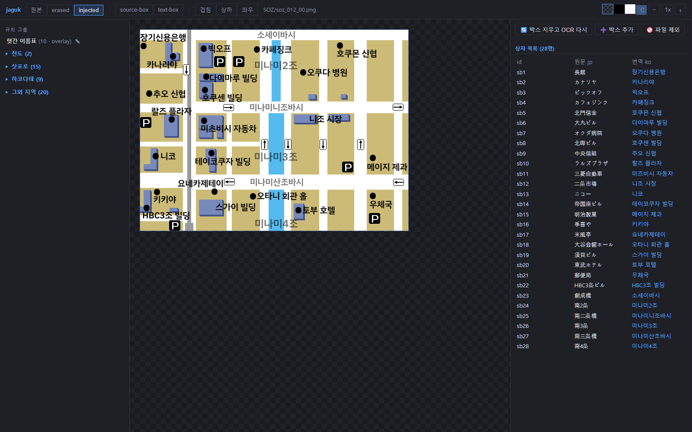

# 예제 — 브라우저에서 jaguk GUI 그대로

[examples/](examples/)에는 실제 한국어 패치 프로젝트의 원장(레저) 데이터로
**jaguk GUI 를 브라우저 단독으로 실행**하는 정적 데모 두 개가 있다.
서버 없이 동작하고, GitHub Pages 로 `…/jaguk/furaiki3/` ·
`…/jaguk/kitae/` 에 서빙된다 (진입점 `…/jaguk/`).

핵심은 **별도 구현이 하나도 없다**는 것이다. 데모는 로컬 `jaguk gui` 가
쓰는 바로 그 [gui.html](typelet/gui.html) 을 그대로 띄우고, 서버 쪽
(gui.py 의 HTTP 핸들러)을 Pyodide/WebAssembly + Pillow 로 브라우저 안에서
구동한다. 흐름은 이렇다:

```
gui.html ── /api/·/img/ 요청 ──▶ 서비스워커 ──▶ 페이지 브리지
                                                   │
        응답 ◀── typelet.gui 핸들러 (Pyodide) ◀── 엔진 워커
```

- 배포 워크플로가 typelet/ 소스를 사이트에 `_typelet/` 로 같이 실으므로,
  typelet(GUI 포함)이 바뀌면 예제도 자동으로 따라간다 — 사본이 갈라질
  일이 없다.
- 원장 수정(상자 이동·번역·스타일·그룹 이름…)은 wasm FS 의 원장에 쓰이고
  브라우저 **localStorage 로만** 미러된다 — 서버·디스크 기록은 없다.
  진입 페이지를 `?reset=1` 로 열면 비운다.
- 렌더는 파이프라인과 같은 `render.py` 다 (실측: 실제 산출물과의 픽셀
  차이는 FreeType 빌드 차이에 의한 가장자리 AA ±수 계조).
- **미지원**: OCR·erase 계열(박스 지우고 OCR 다시, 지우개 재생성) —
  easyocr/manga-ocr 은 wasm 에 없다. 해당 버튼은 오류로 응답한다.
- 첫 진입 때 엔진(Pyodide + Pillow, 수 MB)과 이미지 트리를 한 번
  내려받는다. 이후 조작은 로컬 GUI 와 같다.
- 로컬 실행: **저장소 루트에서** `python -m http.server 8000` →
  `http://localhost:8000/examples/furaiki3/` (엔진이 `../../typelet/`
  소스를 읽는다).

## 풍우래기3 (風雨来記3) — [examples/furaiki3/](examples/furaiki3/)

홋카이도 오토바이 여행 게임의 한국어 패치 원장 **전체 — 912개 파일,
2,589개 행**. 물량과 렌더 규칙의 다양성을 보여주는 예제다:

- 메뉴 아틀라스 한 장에 외곽선·반투명 행·세로쓰기가 섞여 있고,
- 방면 안내판 434장은 규칙 그룹 슬롯으로 좌표를 통일한 채 넘치는 지명만
  가로 압축(squeeze)하며,
- 스팟명 465장은 이미지 전체가 글자인 blank 베이스(text-only 묶음),
- 지도는 글자를 그린 뒤 도로 선화를 알파 감쇠해 덮는 post overlay,
- 그 밖에 run(이어 그리기)·flow(자동 줄바꿈)·distribute(균등 분배)·
  rotate·alpha_clear·rgb_ink·재조합 좌표계까지 원장의 규칙 전부가
  그대로 동작한다.


## 북으로. White Illumination (北へ。) — [examples/kitae/](examples/kitae/)

드림캐스트 연애 어드벤처의 한국어 패치 원장 **전체 — 85개 파일, 511개
행**. overlay 규칙 그룹 중심의 예제다:

- 게임이 공유 베이스 위에 프레임을 얹어 그리는 **overlay 그룹** 47개 —
  GUI 왼쪽 목록이 그룹 단위(카테고리 폴더·✎ 이름변경)이고, 멤버를 열면
  그룹 base 를 밑판으로 깔아 게임에서 보이는 모양대로 확인한다.
- erased 가 없는 same_pattern 멤버는 base 의 지운 판을 공유하고,
  글자 없는 순수 배경(base)은 목록에서 숨긴다(hide_base).
- 손글씨 메모풍의 상자 틸트(angle, 세로쓰기 조합 포함) · 여러 줄(\n) ·
  반투명 잉크를 불투명 판에 얹는 rgb_ink · 다중 drop_shadow.



## 구성

```
examples/
  _app/              공용 런타임
    sw-core.js       서비스워커 — /api/·/img/ 를 엔진으로 중계
    bridge.js        gui.html 에 주입 — 엔진 부팅·중계·localStorage 미러
    engine.js        엔진 워커 — Pyodide + typelet 로드
    glue.py          gui.py 핸들러를 가짜 소켓으로 구동
  <이름>/
    index.html       진입 — 서비스워커 등록 후 app/(진짜 gui.html)로 이동
    sw.js            서비스워커 스텁
    project/         원장 사본 + 브라우저 FS 레이아웃 설정
    fonts/           파이프라인과 같은 실제 글꼴 파일
    assets/          원본(original)·텍스트 지운 판(erased) 이미지
    data.js          에셋 매니페스트 (엔진이 FS 에 실을 파일 목록)
```

새 예제를 추가하려면: 프로젝트의 jaguk 설정으로 원장·글꼴·이미지를 위
구조로 추출하고, 진입 index.html·sw.js 두 장과
[examples/index.html](examples/index.html) 목록 카드를 만들면 된다.
