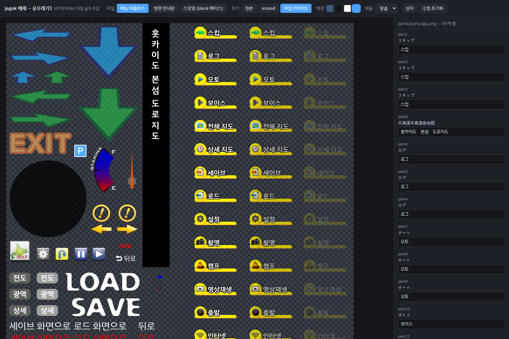
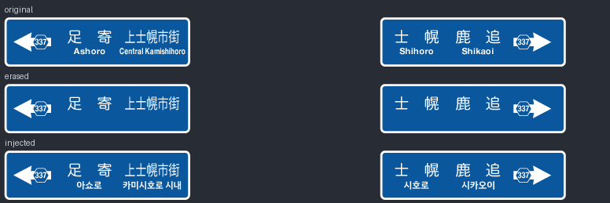
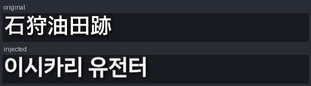
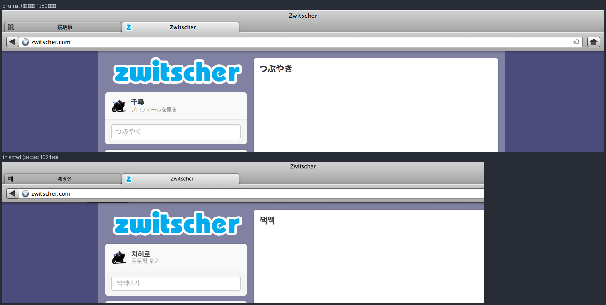

# 예제 — 풍우래기3 (風雨来記3)

풍우래기3 한국어 패치 프로젝트의 실제 원장(레저) 데이터로, **브라우저에서
바로 글자 주입을 실연**하는 정적 데모입니다. 서버 없이 동작합니다 —
GitHub Pages 나 로컬 정적 서버에서 열면 됩니다.



## 열어 보기

```sh
# 저장소 루트에서
python -m http.server 8000
# → http://localhost:8000/examples/furaiki3/
```

오른쪽 패널에서 번역을 고치면 Canvas 가 즉시 다시 렌더링합니다. 수정은
브라우저의 **localStorage 에만** 저장됩니다 — 서버·원장에는 아무것도 쓰지
않습니다. `?file=1&view=original&zoom=2&boxes=1` 식의 URL 로 초기 상태를
지정할 수 있습니다.

## 구성

| 경로 | 내용 |
| --- | --- |
| `index.html` | 데모 앱 — 원장 해석 스펙을 Canvas 2D 로 렌더 |
| `data.js` | 원장에서 추출한 **해석 완료 스펙** (스타일 병합·규칙 적용 후) |
| `assets/original/` | 게임 원본 이미지 |
| `assets/erased/` | 원문 텍스트를 지운 베이스 (`typelet erase` + 손질) |
| `compare/` | 실제 파이프라인 산출물의 전후 비교 이미지 |

수록 파일 세 개가 파이프라인의 대표 경로를 하나씩 보여줍니다:

- **메뉴 아틀라스** (`parts/parts.tga.png`) — 59개 행. 외곽선(hard_outline),
  반투명 행(opacity), 세로쓰기까지 한 장에 모여 있는 스프라이트 아틀라스.
- **방면 안내판** (`parts/roadguidesign/G00483.tga.png`) — 규칙 그룹 슬롯.
  원문 지명 아래에 한국어를 병기하고, 길면 `squeeze` 로 가로만 압축합니다.
- **스팟명** (`parts/saveloadspotname/slsn00328.tga.png`) — blank 베이스
  (이미지 전체가 글자인 text-only). drop_shadow + squeeze.

## 실제 파이프라인 산출물 (Python 렌더러)

이 페이지의 JS 렌더러는 데모용 근사입니다 — 실제 산출물은
[typelet/render.py](../../typelet/render.py) (PIL/FreeType, 4x 슈퍼샘플)가
만들고, 게임에 주입되는 것도 그쪽입니다. 아래는 실제 산출물의 전후 비교:

| | |
| --- | --- |
| 방면 안내판 |  |
| 스팟명 |  |
| 재조합 아틀라스 — 작업은 재조합 좌표계(1280), 저장 시 게임 네이티브(1024)로 복원 |  |

## 데모 렌더러가 옮겨 온 것

`data.js` 의 행은 `typelet.render.resolve()` 가 해석한 최종 스펙과 같은
값입니다 (text 상자, 정렬, 글꼴, 색, 외곽선, 효과). JS 쪽은 그중
이 예제가 쓰는 경로만 구현합니다:

- 펜/베이스라인 정렬 (`text_align` — 가로 l/m/r, 세로 t/m/b)
- 4x 슈퍼샘플 (글자 레이어를 4배로 그려 한 번에 축소)
- 외곽선 (stroke), `drop_shadow(dx,dy,blur,color)`, 반투명 fill
- `overflow: squeeze` (넘치면 가로만 압축, `squeeze_min` 하한)
- 세로쓰기 (orientation: vertical)

글꼴은 Google Fonts 의 IBM Plex Sans KR(OFL)을 씁니다 — 오프라인이면
폴백 글꼴로 근사 렌더됩니다.
